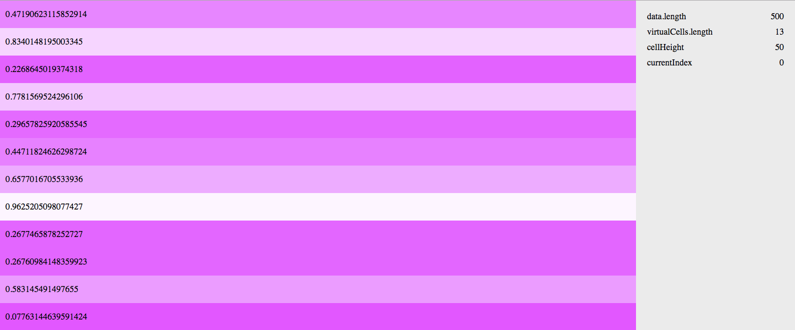

# Scroll over massive data sets by re-using the same DOM elements



Rendering a list of hundreds of thousands of elements in HTML does not work because the browser cannot handle that many nodes. This demos a way to reuse a small number of DOM nodes to emulate scrolling through a long list.

This was originally [Jay Meistrich](https://github.com/jmeistrich)'s idea.

## 1. Define your cell element
All of your cells will be cloned from this. Do not add event listeners to it because they will be lost.
```
let cell = document.createElement('div')
cell.setAttribute('class', 'cell')
```

## 2. Generate some data
It should be in the form of 2-dimensional array, eg, an array of rows where each row is an array. Each row should be the same length.
```
let ny = 1e4, nx = 100
let data = []
for (let i = 0; i < ny; i++) {
    let row = []
    for (let j = 0; j < nx; j++) {
        let number = Math.round(Math.random() * 100)
        row.push(number)
    }
    data.push(row)
}
```

## 3. Optional: Create a proxy for your data
You don't have to do this, but if you want to intercept changes to your data, you can do this through a spreadsheet. This allows you to define events, such as log a message every time a cell's value is changed.
```
let dataProxy = new Proxy(data, {
    deleteProperty: (target, property) => {
        delete target[property]
        return true
    },
    set: (target, property, value, receiver) => {
        target[property] = value
        if (/^\d+$/.test(property)) {
            console.log('updated data', property, value)
        }
        return true
    }
})
```

## 4. Instantiate the `VirtualScroll` class
Now we bring it all together. Create a new instance of `VirtualScroll`. Set `element` to the element that will contain the table, set `data` to the data (or proxy if you defined one), set the cell width and height, optionally turn on debug mode, set `cell` to the cell element that you defined earlier to be cloned, and lastly, define an `update` function that will determine how the cell should be displayed based on the data value.
```
let table = new VirtualScroll({
    element: document.getElementById('table'),
    data: dataProxy,
    cellHeight: 50,
    cellWidth: 200,
    debug: true,
    cell,
    update: (cell, value, rowNumber, columnNumber) => {
        cell.innerHTML = String(value || '')
        let g = Math.round(value / 100 * 255)
        cell.style.background = `rgba(255, ${g}, 255, 1)`
    }
})
```
